# PostgreSQL HA / SRE Platform

A hands-on PostgreSQL high-availability platform built on AWS to demonstrate infrastructure engineering, configuration management, database replication, distributed consensus, automatic failover, recovery testing, and SRE-style validation.

The platform was provisioned with **Terraform**, configured with **Ansible over AWS Systems Manager**, and used **PostgreSQL + Patroni + etcd** to provide an automatically managed primary/replica database cluster. An internal AWS Network Load Balancer provided a stable PostgreSQL endpoint and used Patroni's primary health endpoint to route clients to the active primary.

> This repository documents a temporary lab deployment. The AWS infrastructure was deliberately destroyed after testing and evidence capture.

## What this project demonstrates

- Infrastructure as Code with reusable Terraform modules
- Private EC2 workloads with no SSH or public IP addresses
- Configuration management with Ansible and dynamic AWS inventory
- Administration through AWS Systems Manager
- PostgreSQL streaming replication
- Patroni-managed leader election and automatic failover
- Three-member etcd consensus
- Primary-aware NLB health checking
- Failure injection and recovery validation
- End-to-end troubleshooting
- Cost-controlled deployment and complete Terraform teardown

##
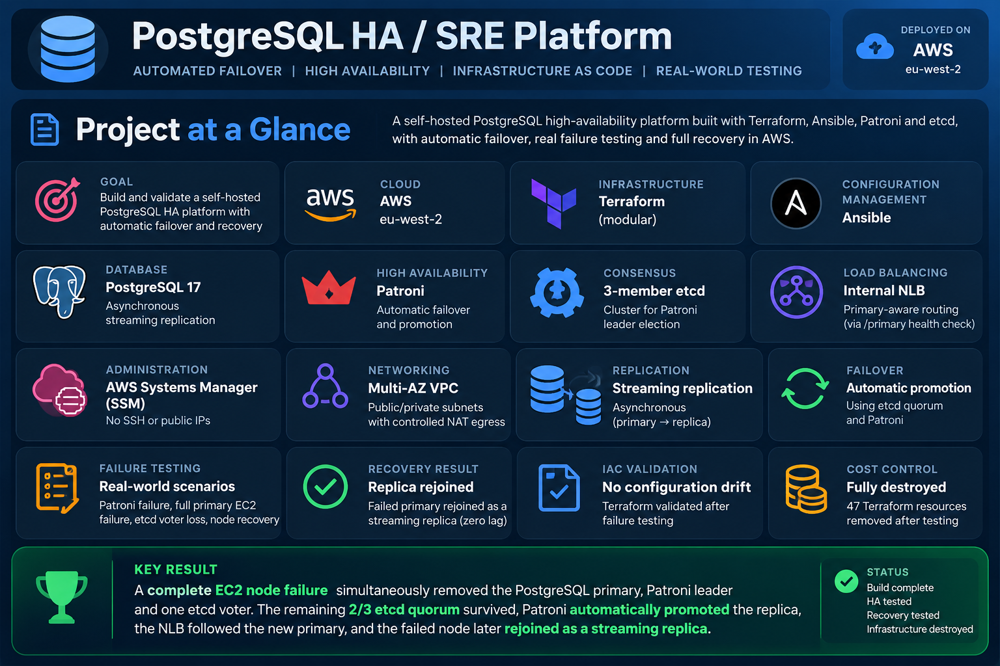

## Architecture

The lab ran in **AWS eu-west-2** inside a dedicated **10.20.0.0/16 VPC**.

| Node | AZ | Role |
| --- | --- | --- |
| pg-01 | eu-west-2a | PostgreSQL, Patroni, etcd voter |
| pg-02 | eu-west-2b | PostgreSQL, Patroni, etcd voter |
| etcd-03 | eu-west-2a | etcd voter only |

Both PostgreSQL nodes were registered with an **internal Network Load Balancer**. The NLB listened on TCP/5432 while its target group used Patroni's HTTP `/primary` endpoint on port 8008. This meant only the Patroni leader was considered a healthy PostgreSQL target.

PostgreSQL data was replicated asynchronously between pg-01 and pg-02. Patroni coordinated PostgreSQL state and failover using the three-member etcd cluster.

AWS Systems Manager provided management access to all nodes, allowing the instances to remain private with **no inbound SSH requirement**.

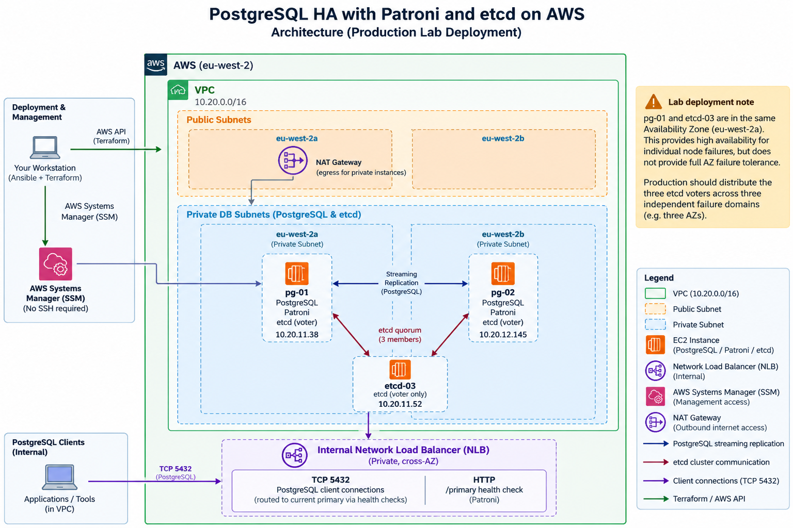

### Lab availability boundary

This deployment intentionally used two Availability Zones to control lab cost. As a result, **pg-01 and etcd-03 shared eu-west-2a**.

The platform therefore demonstrated tolerance of an individual node failure, including loss of a PostgreSQL primary and one etcd voter, but it was **not designed to survive the complete loss of eu-west-2a** because that would remove two of the three etcd voters.

A production design would distribute the three etcd voters across **three independent failure domains/AZs**.

## Technology stack

| Layer | Technology | Purpose |
| --- | --- | --- |
| Cloud | AWS | Runtime infrastructure |
| IaC | Terraform | Provisioning and teardown |
| Configuration | Ansible | OS, PostgreSQL, etcd and Patroni configuration |
| Database | PostgreSQL 17 | Primary/replica database |
| HA manager | Patroni 4.1 | PostgreSQL leadership and failover |
| Consensus | etcd 3.6 | Distributed cluster state |
| Load balancing | AWS NLB | Stable internal PostgreSQL endpoint |
| Administration | AWS Systems Manager | Private-node management without SSH |
| Networking | VPC, subnets, SGs, NAT | Network isolation and controlled egress |

## Repository structure

```text
.
├── ansible/
│   ├── group_vars/
│   ├── inventory/
│   ├── roles/
│   │   ├── common/
│   │   ├── etcd/
│   │   ├── patroni/
│   │   └── postgresql/
│   ├── ansible.cfg
│   └── site.yml
├── images/
└── terraform/
    ├── bootstrap/
    ├── environments/
    │   └── prod/
    └── modules/
        ├── compute/
        ├── load_balancing/
        ├── monitoring/
        ├── networking/
        └── security/
```

## Infrastructure deployment

Terraform created three private EC2 nodes across two Availability Zones, private/public subnets, security controls, NAT egress and an internal NLB. All three EC2 instances had **no public IP address**.

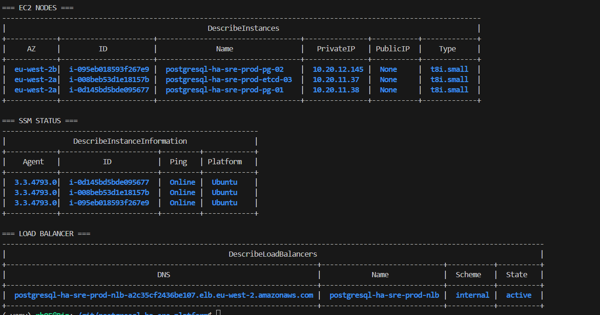

## Private administration with SSM

Ansible used AWS Systems Manager rather than SSH. Dynamic EC2 inventory grouped nodes according to AWS tags.

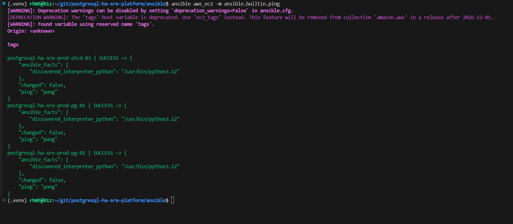

The full Ansible deployment configured PostgreSQL, etcd and Patroni successfully.

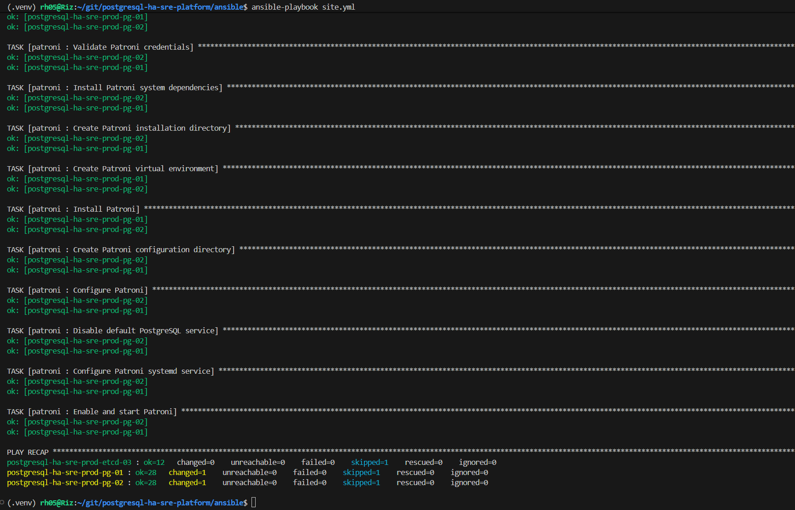

## Three-member etcd quorum

The HA control plane consisted of three etcd voters:

```text
pg-01   ─┐
pg-02   ─┼── etcd quorum: 2 of 3 required
etcd-03 ─┘
```

All three endpoints joined the same cluster and agreed on the same Raft state.

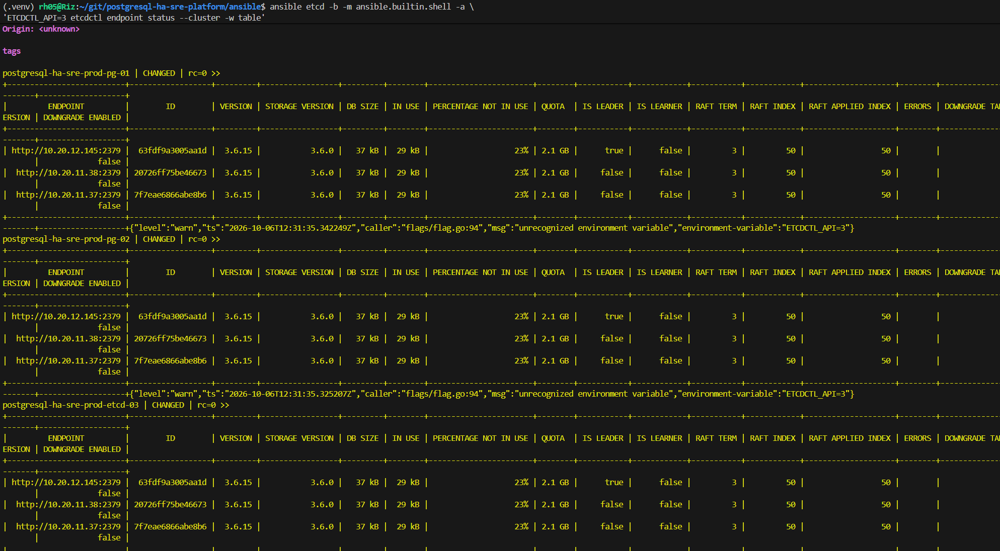

## PostgreSQL streaming replication

Patroni bootstrapped a two-node PostgreSQL cluster with one leader and one streaming replica.

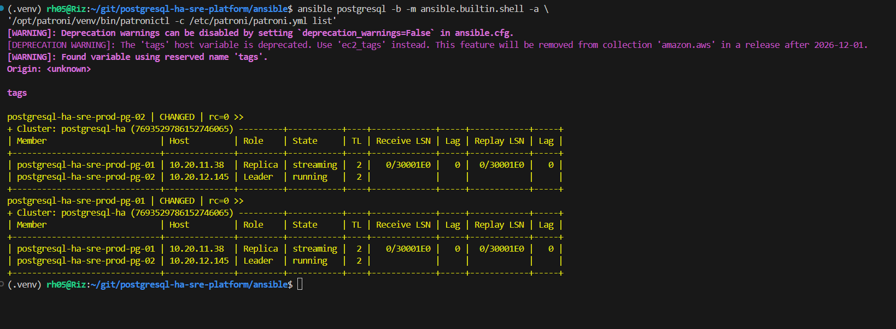

Replication was validated with actual data rather than relying only on service status. A row written to the primary was queried successfully from the replica.

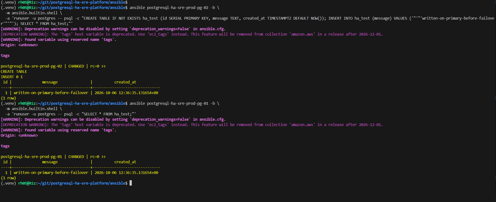

## Automatic failover test

The first failure test stopped Patroni on the active PostgreSQL primary while leaving the EC2 instance and etcd member available.

Before failure:

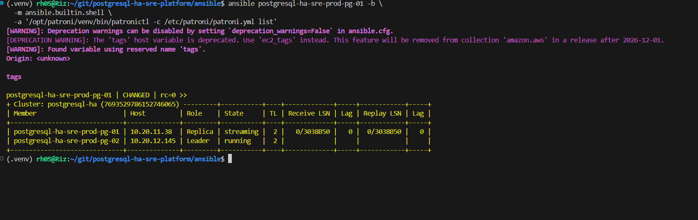

Patroni automatically promoted the replica and advanced the PostgreSQL timeline. No manual database promotion was performed.

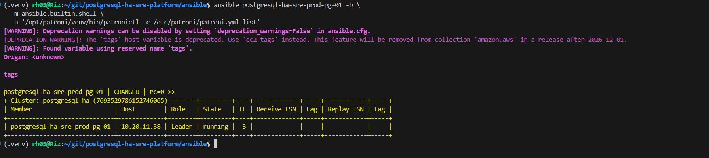

The former primary subsequently returned as a replica and replication continued. New data was written after failover to prove the new leader was writable.

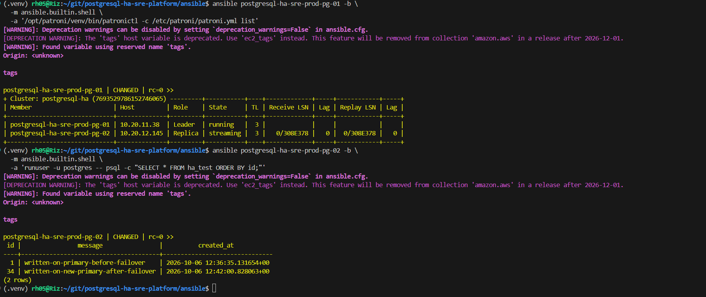

## Primary-aware load balancing

Both PostgreSQL instances remained registered in the NLB target group, but the target group's HTTP health check queried Patroni's `/primary` endpoint.

```text
Current primary  -> healthy
Replica          -> unhealthy
```

An `unhealthy` replica therefore did **not** mean PostgreSQL replication was broken. It meant the node correctly reported that it was not the writable primary.

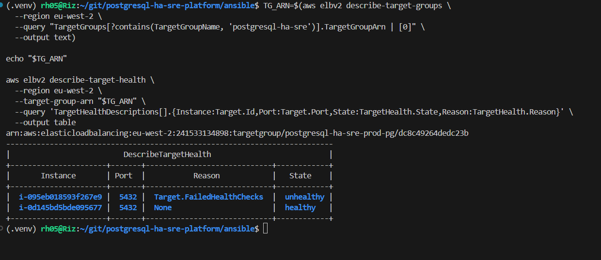

A SQL connection through the stable NLB DNS name reached the active primary.

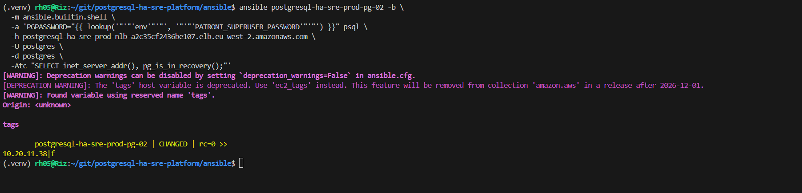

## Full primary-node failure test

The stronger failure scenario stopped the entire **pg-01 EC2 instance**.

Before the failure, pg-01 was the PostgreSQL leader and the etcd cluster had all three voters available.

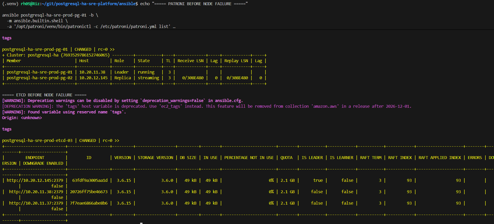

Stopping pg-01 simultaneously removed the PostgreSQL primary, Patroni leader and one of the three etcd voters.

The remaining two etcd members stayed healthy, preserving the required **2/3 quorum**.

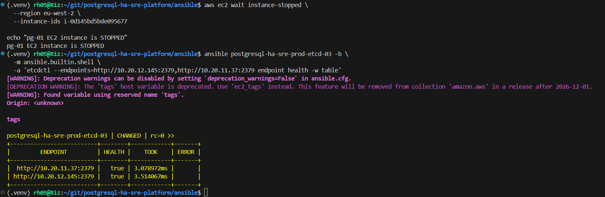

Patroni automatically promoted pg-02. The NLB health check followed the role change: pg-02 became healthy and the failed pg-01 target became unhealthy.

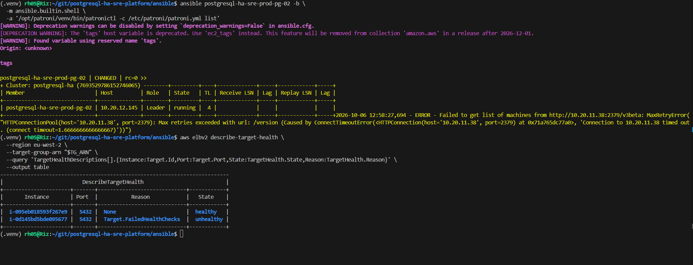

The stable NLB endpoint was then tested from the independent etcd-03 instance and returned pg-02's private address with `pg_is_in_recovery() = false`, proving that clients could reach the new primary without changing endpoints or manually re-registering targets.

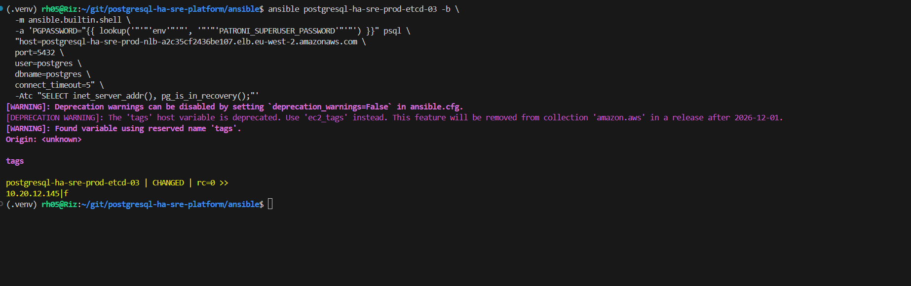

## Automatic recovery

After pg-01 was started again, etcd automatically restored the three-member cluster.

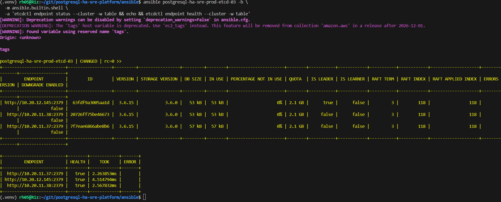

Patroni did **not** fail back unnecessarily. pg-02 remained leader while pg-01 rejoined as a streaming replica on the current PostgreSQL timeline with zero observed lag.

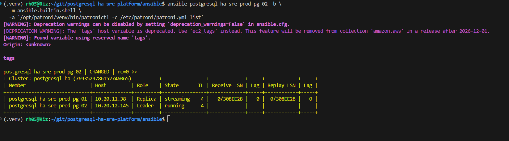

A new row written to pg-02 after pg-01 had rejoined appeared on pg-01, proving that streaming replication had resumed successfully after recovery.

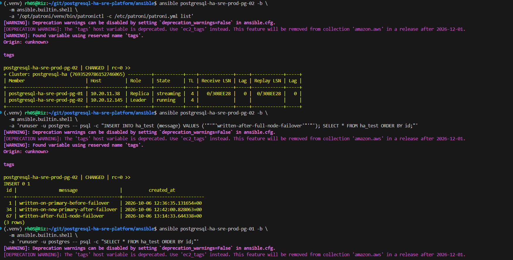

## SRE troubleshooting: NLB security group

End-to-end testing exposed an issue that infrastructure health checks alone did not reveal.

The NLB could health-check the PostgreSQL nodes, but clients inside the VPC initially timed out on TCP/5432. Investigation showed that the NLB security group allowed backend egress but had no client ingress rule for PostgreSQL.

The fix was implemented in Terraform:

```hcl
# Allows clients inside the VPC to connect to PostgreSQL through the internal NLB.
resource "aws_vpc_security_group_ingress_rule" "nlb_postgres" {
  security_group_id = aws_security_group.nlb.id
  cidr_ipv4         = var.vpc_cidr

  from_port   = 5432
  to_port     = 5432
  ip_protocol = "tcp"

  description = "Allow PostgreSQL client traffic from within the VPC"
}
```

After applying the change, SQL through the NLB successfully reached the current Patroni primary.

This demonstrates why **healthy backend targets do not prove that the complete client path works**.

## NLB hairpin testing nuance

During the full-node failure test, pg-02 became both the active PostgreSQL primary and the healthy NLB target.

Testing the NLB from pg-02 itself timed out. An independent test from etcd-03 succeeded through the same NLB endpoint. The failure was therefore treated as a **same-target NLB hairpin/loopback test limitation**, not as evidence that automatic failover had failed.

## Failure-test results

| Scenario | Result |
| --- | --- |
| PostgreSQL streaming replication | ✅ Passed |
| Data visible on replica | ✅ Passed |
| Patroni service failure | ✅ Automatic promotion |
| Former primary rejoin | ✅ Streaming replica |
| Complete primary EC2 failure | ✅ Automatic promotion |
| Loss of one etcd voter | ✅ 2/3 quorum retained |
| NLB follows primary role | ✅ Passed |
| Stable NLB endpoint after node loss | ✅ Passed from independent client |
| Three-member etcd recovery | ✅ Passed |
| Replication after node recovery | ✅ Passed |
| Terraform drift check after testing | ✅ No changes |
| Terraform teardown | ✅ Passed |

## Teardown

The infrastructure was intentionally short-lived. After HA and recovery testing, Terraform reported no configuration drift and the production environment was destroyed.

```text
Destroy complete! Resources: 47 destroyed.
```

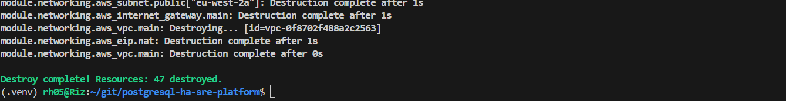

The separate Terraform bootstrap stack was then destroyed as well, removing the versioned S3 remote-state bucket and its supporting resources.

Final AWS checks confirmed no project EC2 instances, NAT Gateways, load balancers, Elastic IPs, RDS instances or PostgreSQL HA S3 buckets remained.

## Design decisions and trade-offs

This project deliberately balances realistic HA engineering with the cost constraints of a temporary portfolio lab.

**Two-AZ / three-voter placement.** Three etcd voters were deployed, but two shared eu-west-2a. This proves individual node-loss tolerance but not full AZ-loss tolerance. Production would use three independent failure domains.

**Single NAT Gateway.** The lab used one NAT Gateway to reduce cost. Production would normally use per-AZ NAT Gateways and AZ-local private route tables where internet egress is required.

**Asynchronous PostgreSQL replication.** Observed replication lag during testing was zero, but asynchronous replication can still lose the most recent transactions during an abrupt failure. The project therefore does not claim RPO 0.

**Internal-only access.** Database nodes had no public IPs and no SSH path. SSM was used for management.

**etcd transport.** The lab used HTTP between etcd members. Production should use TLS and authenticated etcd communication.

**Fencing.** Watchdog/fencing was not implemented. A production-grade deployment should include appropriate fencing safeguards to reduce split-brain risk.

**Monitoring.** A full Prometheus/CloudWatch observability stack was not implemented in this lab and is intentionally not presented as completed functionality.

## Production improvements

A production evolution would include three-AZ etcd placement, TLS, Patroni watchdog/fencing, managed secrets, automated backup/restore testing, CloudWatch/Prometheus metrics and alerting, synthetic PostgreSQL connectivity checks, CI validation for Terraform and Ansible, policy-as-code checks, automated Terraform plan review, and documented rollback/recovery procedures.

## Key lessons

The most valuable part of this project was not simply getting three green EC2 instances. The testing demonstrated the difference between **infrastructure availability**, **consensus availability**, **database leadership**, and **client-path availability**.

In particular:

- a PostgreSQL replica can be healthy while intentionally failing the NLB's primary-only health check
- losing one etcd voter is safe only while quorum remains
- Patroni can promote a replica without changing the client-facing endpoint
- a returning primary should rejoin as a replica rather than immediately taking leadership back
- backend health does not prove client connectivity
- failover tests should be run from an independent client, not only from the active backend
- teardown and cost control are part of the engineering lifecycle

## Status

**Lab completed and infrastructure destroyed.**

The repository preserves the Terraform and Ansible implementation together with evidence from deployment, replication, failover, recovery and teardown testing.
